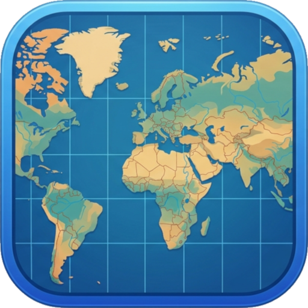

# VectorViewer(벡터뷰어)

ESRI Shapefile(.shp), GeoPackage(.gpkg), GeoJson(.json) 파일 형식의 GIS 벡터 데이터를 열고 속성값을 확인할 수 있는 간단한 프로그램 입니다.

연결 프로그램 -> VectorViewer.exe 파일을 선택해서 사용하세요. 단독으로는 작동하지 않습니다.

OpenAI Codex를 활용하여 제작하였습니다.